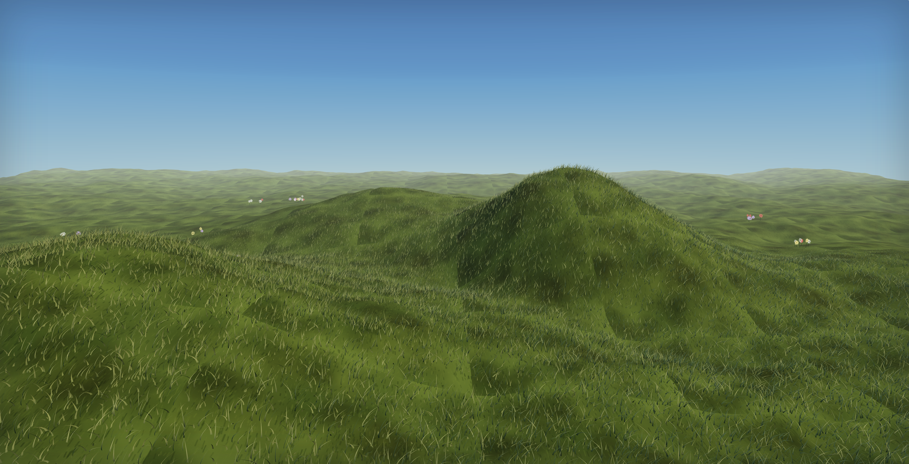

# 🌿 Ox Alpha — Procedural 3D Meadow

> **A painterly, wind-swept summer meadow rendered in real-time with Three.js & WebGL.**  
> Zero external texture assets. 100% procedural mesh generation, custom canvas textures, GPU instanced grass, atmospheric lighting, and interactive wildflowers.


<br/>



<p align="center">
  🎬 <b><a href="preview.mp4">Click here to watch the HD Video Demo (preview.mp4)</a></b>
</p>

---

## ✨ Highlights & Features

- 🌾 **220,000 Instanced Grass Blades**: Near-field high-density geometry with dynamic distance fading seamlessly transferring to terrain LOD textures at range.
- 🎨 **100% Procedural Textures**: Custom runtime canvas-generated tileable albedo, bump, and detail textures with zero image file downloads.
- 💨 **GPU Wind Wave Dynamics**: Multi-frequency trigonometric vertex shader displacement creating organic rolling gust fronts across the field.
- 🦋 **Animated Ground-Level Butterflies**: Procedurally textured butterflies (Monarch, Swallowtail, Blue Morpho, Pink) with realistic wing-flap physics and 3D flight paths.
- 🌺 **Interactive Wildflowers**: Soft painterly crossed-card flower clusters with interactive mouse-brush raycasting physics and elastic spring-back bobbing.
- 🏔️ **Analytic Terrain & Anti-Tiling**: Multi-octave value noise fBm displacement blended with irrational UV scale rotation shader overlays to eliminate repeating tile patterns.
- 🌤️ **Atmospheric Depth**: Horizon-matched `FogExp2`, 3-stop sky gradient dome, drifting cloud sprite clusters, and ACES Filmic tonemapping with vignette.

---

## 🛠️ Tech Stack & Architecture

- **Core**: JavaScript (ES6 Modules), HTML5 WebGL
- **3D Engine**: [Three.js r160](https://threejs.org/) via CDN importmap
- **Controls**: `OrbitControls`
- **Shaders**: Custom GLSL injected via `onBeforeCompile` into standard PBR materials

```
Meadow-3D-WebGL/
├── index.html        # Main entry point (standalone WebGL application)
├── meadow-v4.html    # Versioned release build
├── preview.mp4       # Real-time WebGL scene video preview
├── design.md         # Technical architecture & shader design documentation
├── master-prompt.md # Procedural meadow specification guide
└── README.md         # Project overview & documentation
```

---

## 🚀 Quick Start

### Option 1: Direct File / Local Server
No build tools, bundlers, or `npm install` required!

1. Clone the repository:
   ```bash
   git clone https://github.com/Subhamcode16/Meadow-Threejs.git
   cd Meadow-Threejs
   ```

2. Serve locally using Python or any static file server:
   ```bash
   python -m http.server 8080
   ```

3. Open `http://localhost:8080/index.html` in your web browser.

---

## 🎮 Controls & Interaction

- **Orbit Camera**: Left-click and drag to rotate the view.
- **Pan View**: Right-click and drag.
- **Zoom**: Scroll wheel.
- **Interact with Flowers**: Click and drag across the field to push flower heads and watch them spring back!

---

## ⚙️ Key Shader & Performance Tuning Knobs

All parameters are configured in clean JavaScript/GLSL blocks in `index.html`:

| Parameter | Function | Location / Variable |
| :--- | :--- | :--- |
| **Blade Count** | Adjust density / performance (e.g. 150k for integrated GPUs) | `const BLADES = 220000;` |
| **Grass Color Gradient** | Deep root to sunlit tip GLSL palette | `baseCol` / `tipCol` in `grassMat.onBeforeCompile` |
| **Wind Strength** | Tip displacement multiplier | `bend` factor in `grassMat.onBeforeCompile` |
| **LOD Distance Handoff** | Range where blades fade into terrain texture | `smoothstep(28.0, 46.0, d)` |
| **Flower Density** | Number of wildflower clusters | `for (let cl = 0; cl < 18; cl++)` |

---

## 📄 License

Distributed under the MIT License. See `LICENSE` for details.

---

<p align="center">Crafted with 💚 using Three.js & WebGL</p>
